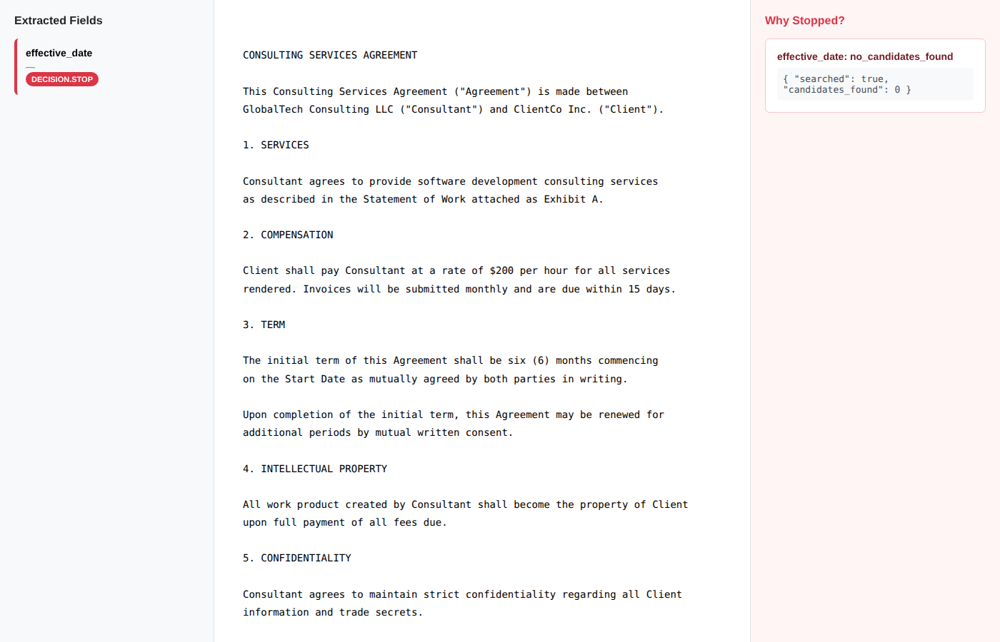
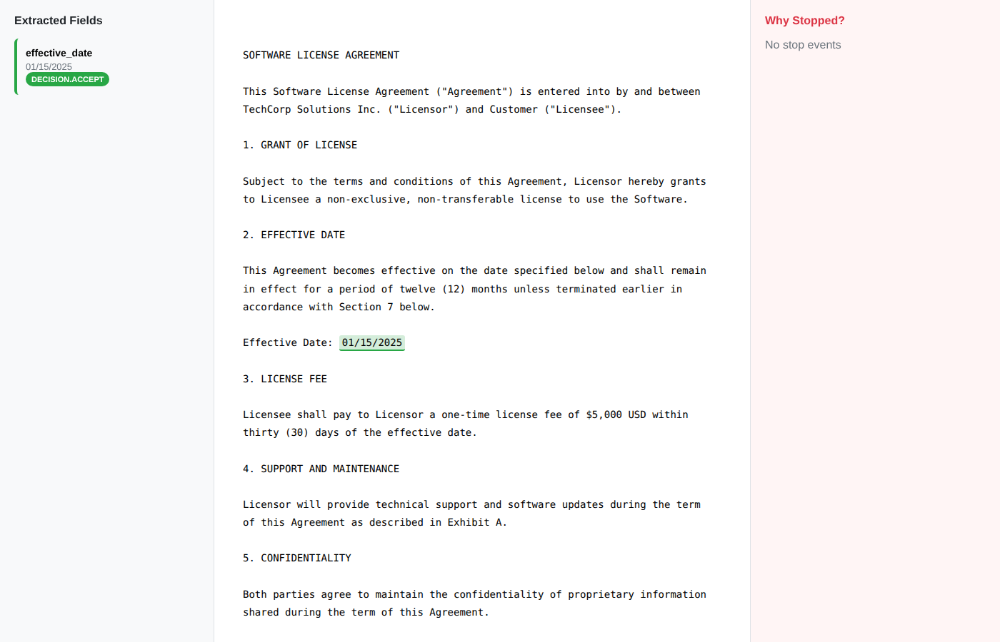

# AJT Grounded Extract

**Judgment-first grounded extraction engine.**
**Returns ACCEPT with evidence or STOP with proof. Nothing in between.**

---

## What This Repository Is

AJT-Grounded-Extract is not just an extraction tool.

It is a reference implementation of a judgment-oriented architecture
that explicitly defines where an AI system must stop
when evidence is insufficient or conflicting.

This repository demonstrates:
- Explicit stopping as a first-class outcome
- Structured negative proof instead of silent failure
- Judgment boundaries enforced by design, not heuristics

Extraction happens only after a judgment boundary is passed.

---

## Executive Summary

**The Problem**: Traditional AI extraction systems guess when evidence is unclear. In contracts, medical records, and financial documents, a confident wrong answer costs more than no answer.

**This Solution**: A system that extracts only when it can prove the answer—or stops and explains why it can't.

**Business Value**:
- **Legal/Compliance**: Audit trail shows the system refused to guess (regulatory defense)
- **Risk Reduction**: Wrong extraction = liability. STOP = documented due diligence.
- **Operational Trust**: Visible failures (STOP events) get fixed. Silent failures compound.

**What makes this different**: Most systems explain their answers. This one explains why it stopped.

**For technical readers**: [Jump to Quick Start](#quick-start-stop-first)
**For business context**: [See Real-World Scenarios](#real-world-scenarios-for-non-technical-readers)

---

## Real-World Scenarios (For Non-Technical Readers)

### Scenario 1: Contract Processing - When STOP Saves You

**Situation**: Your legal team receives 500 vendor contracts to process. You need to extract the "termination notice period" from each contract.

**What happens with typical AI systems**:
- **Contract A**: "30-day notice required" → Extracts "30 days" ✓
- **Contract B**: No termination clause mentioned → Extracts "30 days" (unsupported inference from Contract A) ✗
- **Contract C**: "Notice period TBD in amendment" → Extracts "TBD" or makes up a number ✗

**Result**: Your procurement team schedules vendor terminations based on wrong dates. Legal liability, business disruption, vendor disputes.

**What happens with this system**:
- **Contract A**: "30-day notice required" → **ACCEPT**: Extracted "30 days" with proof (quote + page location)
- **Contract B**: No termination clause → **STOP**: "Searched: termination_notice. Found: nothing. Cannot extract."
- **Contract C**: "Notice period TBD" → **STOP**: "Conflicting signals detected. Requires human review."

**Why this matters**:
- **Contract B** flags for legal review before you make a costly mistake
- **Contract C** gets routed to procurement, not auto-processed
- You have an audit trail showing the system *did not guess*

**Business impact**: Avoid contractual breaches, reduce legal risk, maintain audit compliance.

---

### Scenario 2: Medical Records - When Extraction Errors Kill

**Situation**: Hospital extracts "drug allergy" information from patient intake forms to populate the prescription system.

**What happens with typical AI systems**:
- **Patient X**: "Allergic to penicillin" → Extracts correctly ✓
- **Patient Y**: Form says "allergies: none known" → Extracts "none" ✓
- **Patient Z**: Allergy section left blank (patient forgot to fill it) → Extracts "none" (assumed from context) ✗

**Result**: Patient Z receives penicillin. Allergic reaction. Malpractice lawsuit. Patient harm.

**What happens with this system**:
- **Patient X**: **ACCEPT**: "penicillin" (evidence: quote from line 7 of intake form)
- **Patient Y**: **ACCEPT**: "none known" (evidence: explicit statement in allergy field)
- **Patient Z**: **STOP**: "Allergy field blank. No evidence of 'none' statement. Requires nurse verification."

**Why this matters**:
- **Patient Z's record** gets flagged before prescription
- Nurse confirms allergies in person
- System proves it *did not assume* missing data means "none"

**Business impact**: Patient safety, malpractice risk reduction, regulatory compliance (HIPAA audit trail).

---

### Scenario 3: Financial Compliance - When Silence is Evidence

**Situation**: Bank processes loan applications, extracting "income verification" from submitted tax documents.

**What happens with typical AI systems**:
- **Applicant A**: W-2 shows $85,000 salary → Extracts correctly ✓
- **Applicant B**: Self-employed, 1099 shows $120,000 → Extracts correctly ✓
- **Applicant C**: Submits blank tax form with handwritten note "will provide later" → Extracts "$0" or skips field ✗

**Result**: Loan approved for Applicant C without income verification. Default risk. Regulatory violation (Know Your Customer failure).

**What happens with this system**:
- **Applicant A**: **ACCEPT**: $85,000 (evidence: W-2 line 1, box "Wages")
- **Applicant B**: **ACCEPT**: $120,000 (evidence: 1099 total, box 7)
- **Applicant C**: **STOP**: "No income figure found. Handwritten note detected. Cannot proceed with automated approval."

**Why this matters**:
- **Applicant C** gets routed to manual underwriting
- Compliance officer sees audit trail: system *refused* to guess
- Regulatory examiner sees proof of due diligence

**Business impact**: Regulatory compliance (KYC/AML), reduced default risk, auditable decision trail.

---

### Key Principle: The Cost of Being Wrong vs. The Cost of Stopping

| Decision | Typical AI | This System |
|----------|-----------|-------------|
| **Clear evidence** | Extract (correct) | **ACCEPT** (with proof) |
| **No evidence** | Extract anyway (guesses) | **STOP** (with explanation) |
| **Ambiguous evidence** | Extract (risky) | **STOP** or **NEED_REVIEW** |

**Why executives care**:
- **Liability**: Wrong extraction = legal exposure. STOP = documented due diligence.
- **Compliance**: Regulators ask "how do you know?" STOP events provide proof you didn't guess.
- **Operational Risk**: Silent failures compound. Visible stops get fixed.
- **Trust**: Stakeholders trust a system that says "I don't know" over one that fabricates answers.

**Bottom line**: This system costs you review time on edge cases. It saves you liability costs on catastrophic errors.

---

## Quick Start (STOP-first)

Run the system on a document with missing required evidence. The expected and correct behavior is to STOP.

```bash
python run.py examples/stop_example.txt
```

```json
{
  "status": "STOP",
  "reason": "insufficient evidence",
  "searched": ["effective_date"],
  "found": []
}
```

STOP is a successful outcome. It represents intentional non-execution with auditable proof.

### Visual Example: STOP Viewer



*The HTML viewer shows exactly why extraction stopped, what was searched, and the auditable proof artifact.*

Negative proof is not a failure report — it is evidence of intentional non-execution.

---

## Why This Exists

Most extraction systems fail silently or produce unsupported values when evidence is weak. They optimize for recall, not integrity. When deployed in compliance-critical contexts (contracts, medical records, financial documents), a confidently wrong extraction is worse than no extraction at all.

This system inverts that assumption: **extraction happens only when document evidence is sufficient**. When it's not, the system stops—and produces an auditable artifact explaining what was evaluated and why extraction did not proceed.

Most systems explain answers. **This one explains why it stopped.**

---

## Adversarial Test Results

| Scenario | Input Ambiguity | Expected Failure | Result | Proof Artifact |
|----------|----------------|------------------|--------|----------------|
| Conflicting Dates | Multiple dates (02/01/2025, 03/15/2025) in different contexts | Extraction attempts to guess which date is "effective" | STOP | `no_candidates_found` (system refused to select between conflicting values) |
| Missing Required Field | "Effective date TBD upon executive approval" | Extraction infers date from context or adjacent fields | STOP | `no_candidates_found` (no explicit date value present) |
| Inferential Trap | "Expected to occur approximately 30 days after signing" + "Most tenants move in around February 15th" | Extraction calculates implied date from surrounding narrative | STOP | `no_candidates_found` (system rejected inference from non-binding language) |
| Numeric Ambiguity | APR listed as "5.5% first year" and "7.75% thereafter" with conditional language | Extraction selects one value or averages rates | STOP | `no_candidates_found` (multiple rate values with conditional logic) |
| Table/Text Mismatch | Payment date in table differs from narrative explanation | Extraction chooses table over text (or vice versa) without evidence priority | STOP | `no_candidates_found` (conflicting information sources) |
| Conditional Clause | "Later of (a) capital contribution, (b) March 1, 2025, or (c) license approval" | Extraction picks one condition or attempts logical evaluation | STOP | `no_candidates_found` (conditional logic requires external state verification) |
| Redacted Content | "Effective on ██/██/2025" with sealed terms | Extraction attempts to infer date from context or surrounding dates | STOP | `no_candidates_found` (target field explicitly redacted) |
| Contextual Inference | "First Monday after New Year's Day" + "9:00 AM session on January 6th" | Extraction infers "January 6th" is the effective date based on meeting reference | STOP | `no_candidates_found` (meeting date ≠ agreement effective date) |

All 8 scenarios produced STOP with auditable proof. No extraction occurred when evidence was ambiguous, conflicting, or missing.

---

## When You Would Use This

- **Contract/legal document extraction** where incorrect values create liability
- **Regulatory compliance pipelines** requiring audit trails for AI decisions
- **RAG systems with strict grounding requirements** (healthcare, finance)
- **Document processing where silent failures are unacceptable**
- **Systems where "I don't know" is a valid and valuable output**
- **Contexts where negative proof (evidence of non-execution) is required**

---

## What This Is (in one sentence)

A decision recording system that produces STOP judgments with negative proof or ACCEPT judgments with document-grounded evidence—nothing in between.

---

## STOP Is Not Failure

**STOP is a judgment.**
**STOP is an audit artifact.**
**STOP is how this system succeeds when evidence is insufficient.**

Most systems explain answers. **This one explains why it stopped.**

---

## Status

**v2.1.0** — Audit-ready | Constitution: Frozen | Attack Tests: 10/10 blocked

### Why Attack Tests Exist

Attack tests verify judgment boundaries—not to prevent malicious users, but to confirm that STOP decisions hold under intentional pressure.

Each test attempts to force extraction when evidence is insufficient (adversarial prompts, conflicting values, edge cases). A successful test is one where the system **still stops** and produces the same auditable proof.

This is not prompt security. This is judgment integrity verification.

---

## Installation

```bash
pip install ajt-grounded-extract
```

**Zero dependencies.** Pure Python stdlib.

---

## Core Principle

**Extract structured data only when it can be proven; otherwise stop—and prove that you stopped.**

> **Most systems explain answers. This one explains why it stopped.**

**Regulatory alignment:**
This system supports audit-ready record-keeping for high-risk AI systems.
See [EU AI Act Article 12 alignment](docs/EU_AI_ACT_ALIGNMENT.md).

---

## Philosophy: STOP-first

- **This project does not aim to extract everything.**
- **Extraction occurs only when evidence is sufficient.**
- **When evidence is insufficient, the system stops and proves why.**
- **Evidence Integrity > Recall**: Only extract values with verifiable document evidence
- **Default: STOP**: When evidence is insufficient, conflicting, or missing → stop extraction
- **Negative Proof**: Every STOP includes explicit reason + preserved artifacts
- **No Fine-tuning**: Rule-based + LLM extraction without training pipelines
- **Local Execution**: Runs entirely on local machine

---

## What This System Is

**A judgment trace generator for grounded extraction.**

- ✅ **Records reasoning** about extraction decisions (STOP/ACCEPT)
- ✅ **Produces negative proof** when intentional non-execution occurs
- ✅ **Generates audit artifacts** with evidence grounding
- ✅ **Explains why extraction did NOT proceed** (primary output for STOP events)

**This is a judgment recording component, not an autonomous decision system.**

---

## What This System Is NOT

**This system records judgments; it does not make decisions on behalf of the caller.**

- ❌ **Decision engine** — Does not execute, enforce, or decide for you
- ❌ **Policy executor** — Does not implement business rules or enforce outcomes
- ❌ **Automation controller** — Does not trigger actions based on judgments
- ❌ **Enforcement system** — Does not block, allow, or control execution flow
- ❌ Multi-domain rule engine
- ❌ Enterprise extraction with thresholds
- ❌ Training/fine-tuning pipeline
- ❌ High-recall extraction system

**What we provide**:
- ✅ **Advisory judgment signals** (STOP = recommendation, not block)
- ✅ **Negative proof artifacts** (evidence of intentional non-execution)
- ✅ **Traceability** (decision_maker identity required)
- ✅ **Audit trail** (write-once logs with reasoning)

---

## Responsibility Boundary

**This system does NOT own execution authority, decision outcomes, or result responsibility.**

### What This System Does
- **Recommend** extraction actions based on evidence sufficiency
- **Record** the rationale for STOP/ACCEPT judgments
- **Explain** why execution did NOT proceed (for STOP events)
- **Produce** audit artifacts with evidence grounding

### What This System Does NOT Do
- **Execute** business logic or trigger downstream actions
- **Enforce** policies or prevent operations
- **Decide** on behalf of the caller or end user
- **Own** the outcome or consequences of extraction results

### Execution Authority
**Execution authority and result ownership remain with the external caller.**

- The caller decides whether to act on STOP/ACCEPT signals
- The caller owns the consequences of using (or ignoring) extraction results
- This system generates reasoning traces, not commands
- STOP is an **advisory interruption**, not a hard block

---

## STOP Semantics

**STOP is not a failure. STOP is not a block. STOP is an advisory judgment signal.**

### What STOP Means
- **STOP = Advisory signal**: "Extraction did not proceed due to insufficient evidence"
- **STOP = Intentional non-execution**: A deliberate decision not to extract, with reasoning
- **STOP = Negative proof**: Evidence that the system evaluated alternatives and chose not to proceed

### What STOP Is NOT
- ❌ **Not a hard block** — Does not prevent the caller from taking action
- ❌ **Not a failure** — Successful operation that produced a judgment artifact
- ❌ **Not enforcement** — Does not control or restrict external systems
- ❌ **Not a command** — Does not instruct the caller what to do

### STOP Output
When STOP occurs, this system produces:
- **stop_reason**: Machine-readable reason code (e.g., `no_candidates_found`)
- **stop_proof**: Artifact showing what was evaluated and why extraction did not proceed
- **decision_log**: Timestamped record of the judgment process

**Example STOP message:**
> "This STOP is an advisory judgment signal. Execution authority remains with the caller. This system records the rationale for intentional non-execution."

---

## Negative Proof

**Negative proof is a first-class artifact produced when intentional non-execution occurs.**

### Definition
A **negative proof** is evidence that:
1. The system **evaluated** extraction candidates
2. The system **determined** that evidence was insufficient
3. The system **recorded** the reasoning and evaluated alternatives
4. The system **chose** not to extract (intentional non-execution)

### Structure
Negative proof includes:
- **What was searched**: Fields, patterns, or rules evaluated
- **What was found**: Number of candidates, conflicting values, confidence scores
- **Why extraction stopped**: Explicit reason code with supporting data
- **When the judgment was made**: Timestamp and hash for integrity

### Purpose
Negative proof serves as:
- **Audit trail** for regulatory compliance
- **Debugging evidence** for system operators
- **Transparency artifact** for end users
- **Accountability record** showing the system did NOT blindly execute

**Negative proof is not a failure report—it is evidence of intentional non-execution.**

---

## Architectural Scope

This repository represents Phase 1 of the AJT approach:

**Phase 1 — Internal Judgment**
- Judgment rules are enforced inside the extraction pipeline
- STOP is a valid and expected outcome
- Evidence grounding is mandatory

Later phases extend this concept outward,
but are intentionally out of scope for this repository.

---

## Architecture

```
Document → Ingest → Extract → Ground → Judge → Archive
           ↓        ↓         ↓        ↓        ↓
           Hash     Candidates Evidence STOP?   Artifacts
```

### Pipeline Stages

1. **Ingest**: Load document, compute hash, build line index
2. **Extract**: Find candidate values (rule-based or LLM)
3. **Ground**: Map each value to exact document span (quote + offsets)
4. **Judge**: STOP-first decision: `ACCEPT | STOP | NEED_REVIEW`
5. **Archive**: Write-once artifacts with timestamps + integrity hashes

### Decision Taxonomy

- **ACCEPT**: Evidence found, confidence sufficient, integrity verified
- **STOP**: No candidates, conflict, low confidence, or integrity failure
- **NEED_REVIEW**: Edge cases requiring human judgment

---

## More Examples

### Run Extraction

```bash
# ACCEPT case (has clear "Effective Date: 01/15/2025")
python run.py examples/accept_example.txt

# STOP case (no explicit effective date)
python run.py examples/stop_example.txt
```

### View Results

Open generated HTML viewer:
```bash
open viewer/accept_example_viewer.html
open viewer/stop_example_viewer.html
```

#### ACCEPT Viewer: Evidence Grounding



*ACCEPT decisions show the extracted value with exact document span, byte offsets, and highlighted evidence.*

---

## Output Format

### JSON Result (ACCEPT)
```json
{
  "field_name": "effective_date",
  "decision": "ACCEPT",
  "value": "01/15/2025",
  "evidence": {
    "quote": "01/15/2025",
    "start": 245,
    "end": 255,
    "line": 12,
    "context": "...Effective Date: 01/15/2025..."
  },
  "confidence": 0.9,
  "decision_role": "advisory",
  "execution_authority": "external"
}
```

**Metadata fields**:
- `decision_role`: Always `"advisory"` — This system recommends, does not decide
- `execution_authority`: Always `"external"` — Caller owns execution decisions

---

### STOP Event
```json
{
  "field_name": "effective_date",
  "decision": "STOP",
  "value": null,
  "stop_reason": "no_candidates_found",
  "stop_proof": {
    "searched": true,
    "candidates_found": 0
  },
  "decision_role": "advisory",
  "execution_authority": "external",
  "stop_semantics": "non_blocking",
  "negative_proof_type": "intentional_non_execution"
}
```

**Metadata fields**:
- `decision_role`: Always `"advisory"` — STOP is a recommendation, not enforcement
- `execution_authority`: Always `"external"` — Caller decides how to handle STOP
- `stop_semantics`: Always `"non_blocking"` — STOP does not prevent caller action
- `negative_proof_type`: Always `"intentional_non_execution"` — Evidence of deliberate non-extraction

---

## HTML Viewer Features

- **Evidence Highlighting**: Green (ACCEPT) / Red (STOP)
- **Navigation Sidebar**: Jump to extracted fields
- **"Why Stopped" Panel**: Explicit reasons with proof artifacts
- **Offset Mapping**: Click evidence span → see exact document location

---

## Directory Structure

```
ajt-grounded-extract/
├── schema/              # Field definitions
├── engine/              # Core extraction modules
│   ├── ingest.py
│   ├── extract.py
│   ├── ground.py
│   ├── judge.py
│   └── archive.py
├── viewer/              # HTML viewer generator
├── evidence/            # Write-once artifacts (JSONL + manifests)
├── examples/            # Demo documents
└── run.py               # CLI entry point
```

---

## Evidence Requirements

All extractions must satisfy:

- ✅ `require_exact_quote`: Value must appear verbatim in document
- ✅ `require_offset_mapping`: Quote mapped to byte offsets
- ✅ `stop_on_conflict`: Multiple conflicting values → STOP
- ✅ `min_confidence`: Below threshold → STOP

---

## Acceptance Criteria

- [x] Demo shows at least one ACCEPT and one STOP
- [x] STOP includes explicit reason and preserved artifacts
- [x] Viewer navigates evidence spans correctly
- [x] Non-goals stated explicitly

---

## Regulatory Mapping & Review

This system includes industry-specific regulatory risk mappings for:
- **Financial Services** — Authorization scope, customer isolation, advisory vs execution separation
- **Healthcare** — Patient data isolation, complete clinical evidence requirements, clinician traceability
- **Legal Practice** — Attorney responsibility, client-matter isolation, conflict-of-interest prevention

**Navigation**: See [REGULATORY_REVIEW_GUIDE.md](REGULATORY_REVIEW_GUIDE.md) for audience-specific entry points.

**Key documents**:
- [REGULATORY_META_MAP.md](REGULATORY_META_MAP.md) — Cross-industry risk-control mappings
- [docs/REG_MAP_FINANCE.md](docs/REG_MAP_FINANCE.md) — Financial services mapping
- [docs/REG_MAP_HEALTHCARE.md](docs/REG_MAP_HEALTHCARE.md) — Healthcare mapping
- [docs/REG_MAP_LEGAL.md](docs/REG_MAP_LEGAL.md) — Legal practice mapping
- [COMPLIANCE_GUIDE.md](COMPLIANCE_GUIDE.md) — Audit artifact generation
- [ATTACK_TEST.md](ATTACK_TEST.md) — Adversarial verification results

**Principle**: This project demonstrates how specified risks are blocked. It does not claim regulatory compliance.

---

## Reference

### Normative Specification

This implementation follows the **AJT (AI Judgment Trail)** constitutional framework:
- **Spec Repository**: [spec](https://github.com/Nick-heo-eg/spec) — Normative rules and judgment structure
- **Reference Implementation**: This repository (ajt-grounded-extract) — Executable proof of concept

**Relationship**:
- `spec`: Constitutional rules (what must be proven)
- `ajt-grounded-extract`: Execution + case law (how it's proven in practice)

---

### Motivation

**Motivated by [ajt-negative-proof-sim](https://github.com/Nick-heo-eg/ajt-negative-proof-sim) (sealed reference).**

Core principle: **Prove extraction succeeded OR prove why you stopped.**

---

## Recent Changes (v2.1.0 → Boundary Seal)

**Purpose**: Seal responsibility boundary and STOP semantics to eliminate ambiguity about system role.

**Changes**:
1. **Responsibility Boundary Documentation** — Explicit declaration that this system does not execute, enforce, or decide on behalf of the caller. Execution authority and result ownership remain external.
2. **STOP Semantics Clarification** — STOP is an advisory signal (non-blocking recommendation), not a hard block or failure. STOP events produce negative proof artifacts as first-class outputs.
3. **Negative Proof Definition** — Formal definition of negative proof as evidence of intentional non-execution, including what was evaluated and why extraction did not proceed.
4. **Decision Log Metadata** — All judgment outputs now include fixed metadata fields: `decision_role=advisory`, `execution_authority=external`, `stop_semantics=non_blocking`, `negative_proof_type=intentional_non_execution`.
5. **Runtime Advisory Messages** — CLI output includes explicit advisory notice when STOP occurs: "This STOP is an advisory judgment signal. Execution authority remains with the caller."

**No functional changes**: Judgment logic, STOP conditions, and LLM behavior unchanged. This release clarifies system boundaries and removes interpretation ambiguity.

---

## Judgment Boundary Proofs

This repository includes documented proof cases
showing where the system explicitly stops.

See:
- [Judgment Boundary Proofs](docs/JUDGMENT_BOUNDARY_PROOFS.md) — Concrete examples of enforced boundaries
- [STOP Casebook](docs/STOP_CASEBOOK.md) — Reusable patterns and classification

These documents demonstrate that STOP is not failure,
but evidence of correct boundary enforcement.

---

## License

MIT
